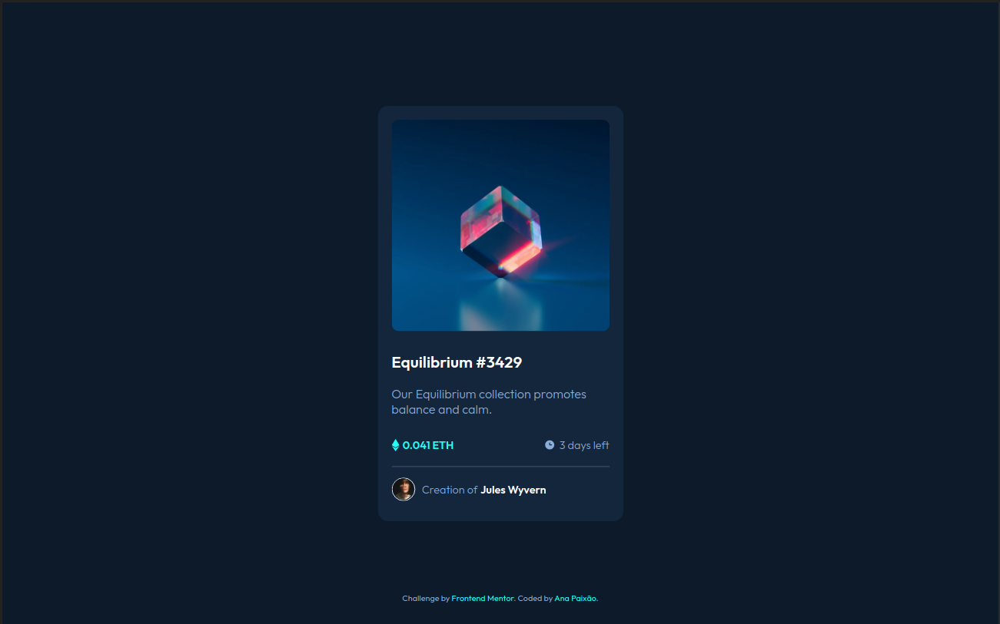
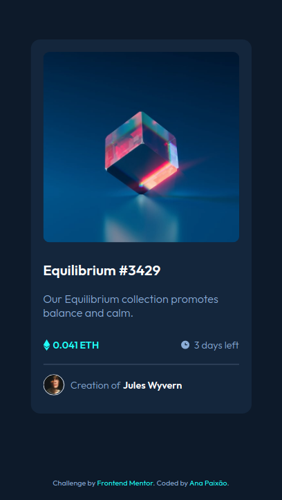

<h1 align="center">
    <a href="https://anapaixao.github.io/nft-preview-card-component/">🔗 NFT PREVIEW CARD COMPONENT </a>
</h1>

Frontend Mentor challenge

Frontend Mentor challenges help you improve your coding skills by building realistic projects.

### The challenge
Users should be able to:

- View the optimal layout depending on their device's screen size
- See hover states for interactive elements

## Screenshot

### NFT PREVIEW CARD COMPONENT - Desktop 

### NFT PREVIEW CARD COMPONENT - Mobile

## Built with

- HTML
- CSS / SCSS
- FlexBox

## Links

- Site : [NFT PREVIEW CARD COMPONENT SOLUTION](https://anapaixao.github.io/nft-preview-card-component/)

---

Made with ♥ by Ana Paixão :wave: [Get in touch!](https://www.linkedin.com/in/ana-clara-paixao/)

